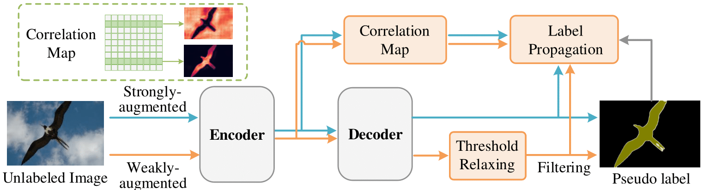

# CorrMatch

This repository contains the official implementation of the following paper:

> **[CorrMatch: Label Propagation via Correlation Matching for Semi-Supervised Semantic Segmentation](https://arxiv.org/abs/2306.04300)**</br>
> [Boyuan Sun](https://github.com/BBBBchan/CorrMatch), [Yuqi Yang](https://github.com/BBBBchan/CorrMatch), [Weifeng Yuan](https://github.com/BBBBchan/CorrMatch), [Le Zhang](http://zhangleuestc.cn/), [Ming-Ming Cheng](https://mmcheng.net/cmm/),  [Qibin Hou](https://houqb.github.io/)</br>

## Overview
CorrMatch provides a solution for mining more high-quality regions from the unlabeled images to leverage the unlabeled data more efficiently for consistency regularization.


We first introduce an adaptive threshold updating strategy with a relaxed initialization to expand the high-quality regions. Then we propose to propagate high-confidence predictions with correlation maps.

For technical details, please refer to our full paper on [arXiv](https://arxiv.org/abs/2306.04300).
## Getting Started

### Installation

```bash
git clone git@github.com:BBBBchan/CorrMatch.git
cd CorrMatch
conda create -n corrmatch python=3.8
conda activate corrmatch
conda install pytorch==1.13.1 torchvision==0.14.1 torchaudio==0.13.1 pytorch-cuda=11.7 -c pytorch -c nvidia
pip install opencv-python tqdm einops, pyyaml
```

### Pretrained Backbone:
[ResNet-101](https://drive.google.com/file/d/1Rx0legsMolCWENpfvE2jUScT3ogalMO8/view?usp=sharing)
```bash
mkdir pretrained
```
Please put the pretrained model under `pretrained` dictionary.


### Dataset:

- Pascal VOC 2012: [JPEGImages](http://host.robots.ox.ac.uk/pascal/VOC/voc2012/VOCtrainval_11-May-2012.tar) | [SegmentationClass](https://drive.google.com/file/d/1ikrDlsai5QSf2GiSUR3f8PZUzyTubcuF/view?usp=sharing)
- Cityscapes: [leftImg8bit](https://www.cityscapes-dataset.com/file-handling/?packageID=3) | [gtFine](https://drive.google.com/file/d/1E_27g9tuHm6baBqcA7jct_jqcGA89QPm/view?usp=sharing)

Please modify the dataset path in configuration files.*The groundtruth mask ids have already been pre-processed. You may use them directly.*

Your dataset path may look like:
```
├── [Your Pascal Path]
    ├── JPEGImages
    └── SegmentationClass
    
├── [Your Cityscapes Path]
    ├── leftImg8bit
    └── gtFine
```

## Usage

### Training CorrMatch

```bash
sh tools/train.sh <num_gpu> <port>
```
To run on different labeled data partitions or different datasets, please modify:

``config``, ``labeled_id_path``, ``unlabeled_id_path``, and ``save_path`` in [train.sh](https://github.com/BBBBchan/CorrMatch/blob/main/tools/train.sh).

### Evaluation
```bash
sh tools/val.sh <num_gpu> <port>
```
To evaluate your checkpoint, please modify ``checkpoint_path`` in [val.sh](https://github.com/BBBBchan/CorrMatch/blob/main/tools/val.sh).

## Results

### Pascal VOC 2012

Labeled images are sampled from the **original high-quality** training set. Results are obtained by DeepLabv3+ based on ResNet-101 with training size 321(513).

|        Method        | 1/16 (92) | 1/8 (183) |    1/4 (366)    |    1/2 (732)    |   Full (1464)   |
|:--------------------:|:---------:|:---------:|:---------------:|:---------------:|:---------------:|
|       SupOnly        |   45.1    |   55.3    |      64.8       |      69.7       |      73.5       |
|         ST++         |   65.2    |   71.0    |      74.6       |      77.3       |      79.1       |
|        PS-MT         |   65.8    |   69.6    |      76.6       |      78.4       |      80.0       |
|       UniMatch       |   75.2    |   77.2    |      78.8       |      79.9       |      81.2       |
| **CorrMatch (Ours)** | **76.2**  | **78.3**  | 78.9 (**79.4**) | 80.4 (**80.6**) | 81.3 (**81.4**) |


### Cityscapes

Results are obtained by DeepLabv3+ based on ResNet-101.

|        Method        | 1/16 (186) | 1/8 (372) | 1/4   (744) | 1/2 (1488) |
|:--------------------:|:----------:|:---------:|:-----------:|:----------:|
|       SupOnly        |    65.7    |   72.5    |    74.4     |    77.8    |
|       UniMatch       |    76.6    |  77.9   |   79.2     |    79.5    |
| **CorrMatch (Ours)** |  **77.3**  | **78.1**  |  **79.4**   |  **80.3**  |

## Citation

If you find our repo useful for your research, please consider citing our paper:

```bibtex
@article{sun2023corrmatch,
  title={CorrMatch: Label Propagation via Correlation Matching for Semi-Supervised Semantic Segmentation},
  author={Sun, Boyuan and Yang, Yuqi and Zhang, Le and Cheng, Ming-Ming and Hou, Qibin},
  journal={arXiv preprint arXiv:2306.04300},
  year={2023}
}
```

## License
This code is licensed under the [Creative Commons Attribution-NonCommercial 4.0 International](https://creativecommons.org/licenses/by-nc/4.0/) for non-commercial use only.
Please note that any commercial use of this code requires formal permission prior to use.

## Contact

For technical questions, please contact `sbysbysby123[AT]gmail.com`.

For commercial licensing, please contact `cmm[AT]nankai.edu.cn` or `andrewhoux@gmail.com`.

## Acknowledgement

We thank [UniMatch](https://github.com/LiheYoung/UniMatch), [CPS](https://github.com/charlesCXK/TorchSemiSeg), [CutMix-Seg](https://github.com/Britefury/cutmix-semisup-seg), [DeepLabv3Plus](https://github.com/YudeWang/deeplabv3plus-pytorch),  [U<sup>2</sup>PL](https://github.com/Haochen-Wang409/U2PL) and other excellent works (see this [project](https://github.com/BBBBchan/Awesome-Semi-Supervised-Semantic-Segmentation)) for their amazing projects!
